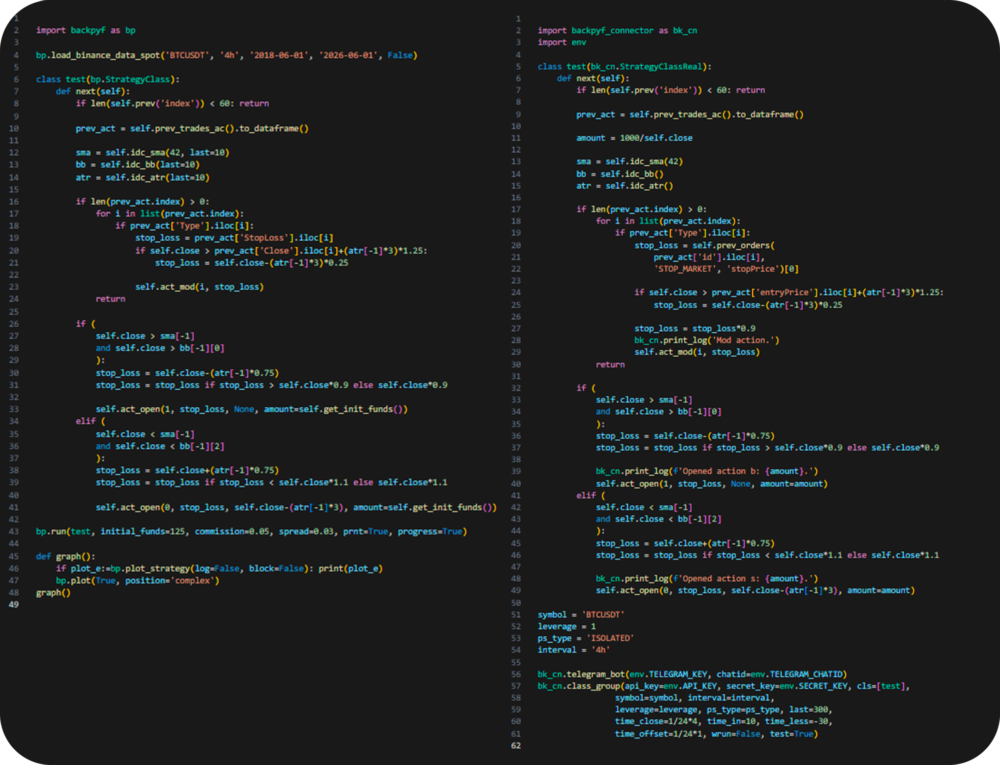

  

# BackPy-binance-connector

**BackPy** is a library for creating strategies and automating them in real life using the Binance API.
It is a library that seeks to expand the functionalities of BackPy by 
providing the possibility of carrying out real trading using the Binance API.

## ⚠️ Important Notices

Please make sure to read the following before using this software:

- [Risk Notice](Risk_notice.txt)
- [License](LICENSE)

By using this software, you acknowledge that you have read and agree to the terms outlined in these documents.

## 🚀 Code example

With backpy-binance-connector you can automate your strategies very quickly.

## 📦 How to install backpy-binance-connector with pip

This module needs to have backpyf>=0.9.69b3 installed, download it 
from: https://github.com/diego-cores/BackPy or install it 
with the command 'pip install .[backpyf]'.

1. Download the latest version from GitHub
- Go to this project GitHub page.
- Download the ZIP file of the latest version of the project.
2. Unzip the ZIP file
- Unzip the ZIP file you downloaded.
- This will give you a folder containing the project files.
3. Open the terminal
- Open the terminal in your operating system.
- Navigate to the folder you just unzipped. You can use the cd command to change directories.
4. Install the module
- Once you are in the project folder in the terminal, run the following command: 'pip install .' 
    and 'pip install .[backpyf]' if you have git installed, otherwise you can go to: https://github.com/diego-cores/BackPy and install it manually
- This command will install the Python module using the setup.py file located in the project folder.
5. Verify installation
- After the installation process finishes without errors, you can verify if the module has been installed correctly by running some code that imports the newly installed module.
6. Clean downloaded files
- After you have verified that the module is working correctly, you can delete the downloaded ZIP file and unzipped folder if you wish.

### Disclaimer
The above code is only an illustrative example to show how to use backpy in conjunction with backpy-binance.
It does not represent a recommended investment strategy.
Cryptocurrency trading involves significant risk, and investment decisions should be made responsibly and with professional advice if necessary.
Use of this library is at your own risk.
